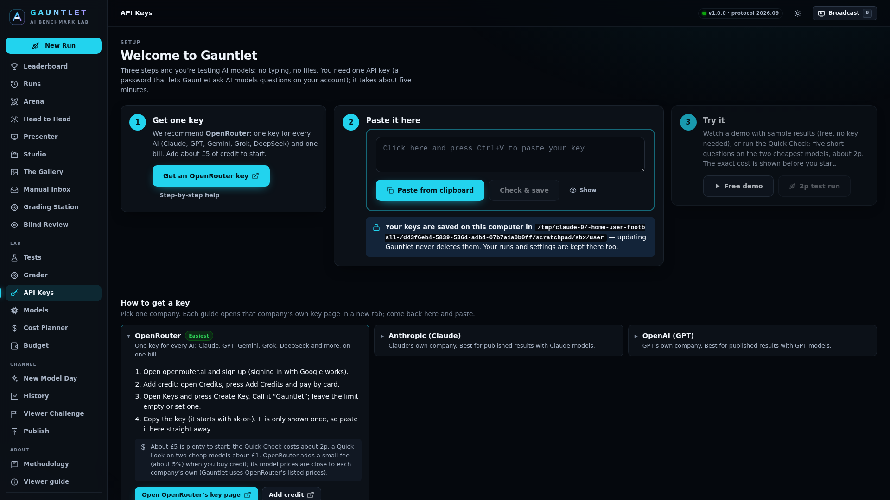

# Setting up Gauntlet on Windows

No typing, no commands. You need a Windows computer and about ten minutes.

## First time

1. **Unzip.** Right-click the Gauntlet zip file → **Extract All…** → **Extract**. A folder opens.
   (Anywhere is fine: Desktop, Documents, Downloads, OneDrive.)
2. **Start.** In that folder, double-click **`start-gauntlet.bat`**.
   * If Windows says **"Windows protected your PC"**, click **More info** → **Run anyway**. (Windows says this about
     every file downloaded from the internet that isn't from a big company.)
   * If it says Node.js isn't installed, press **Y**. When it finishes, close the black window and double-click
     `start-gauntlet.bat` again.
   * The first start takes a minute or two (it downloads Gauntlet's building blocks). Later starts take seconds.
   * Keep the black window open while you use Gauntlet. Closing it stops Gauntlet.
3. **Paste your key.** Your browser opens on the **Welcome** page:
   1. **Get one key.** We recommend **OpenRouter**: one key for every AI (Claude, GPT, Gemini, Grok, DeepSeek) and one
      bill. Press **Get an OpenRouter key**, sign up, add about £5 of credit, press **Create Key** and copy it.
      (Prefer a company's own key? Open **Step-by-step help** for Anthropic, OpenAI, Google and others.)
   2. **Paste it.** Click in the big box and press **Ctrl+V**, or press **Paste from clipboard**. That's it: Gauntlet
      works out which company the key is from, checks it for free and saves it. You'll see
      **"✓ OpenRouter key works — 18 models ready"**.
   3. **Try it.** Press **Free demo** to look around with sample results, or **2p test run** for a real test on the two
      cheapest models (the exact cost is shown before you press Start).
4. **Next time:** double-click **Gauntlet** on your desktop.

## Updating to a new version

Extract the new zip **anywhere** (a new folder is fine, or over the old one) and double-click its
`start-gauntlet.bat`. Your keys, runs and settings are kept. The desktop shortcut is moved to the new copy
automatically. You can delete the old folder afterwards if you like.

## Where your things are kept

Your API keys, runs and settings are saved on this computer in

    C:\Users\<you>\AppData\Roaming\Gauntlet

(the API Keys page shows the exact folder). They are **not** inside the Gauntlet folder, so updating Gauntlet never
deletes them. The first time a new version starts, it copies keys, runs and settings over from your old Gauntlet folder
once (it looks where the old desktop shortcut pointed, and in Desktop, OneDrive\Desktop, Downloads and Documents). The
old copies are left where they were; `migration-log.txt` in that folder lists what was copied.

## Adding more keys

Open **API Keys** in the sidebar and paste any key into **Paste any API key**. Several keys at once (one per line) work
too, and so do lines copied from a `.env` file such as `ANTHROPIC_API_KEY=sk-ant-…`. If Gauntlet can't tell which company
a key is from, it asks with big buttons.

With an OpenRouter key, every model whose own company isn't connected runs **via OpenRouter**. A company's own key always
wins. The API Keys page shows which OpenRouter model each Gauntlet model uses ("Claude Opus 5.5 → anthropic/claude-opus-5.5
✓") and which ones aren't available there. For results you publish, a company's own key is the gold standard (see
[METHODOLOGY](docs/METHODOLOGY.md#4a-one-key-for-everything-openrouter)).

## Troubleshooting

| What you see | What to do |
|---|---|
| **"Windows protected your PC"** | Click **More info** → **Run anyway**. |
| **"Node.js (the engine Gauntlet runs on) is not installed."** | Press **Y** to install it. If that fails, download the **LTS** version from nodejs.org, install it, then double-click `start-gauntlet.bat` again. |
| **"Your Node.js is version … Gauntlet needs 22.18 or newer."** | Install the **LTS** version from nodejs.org (it replaces the old one), then start again. |
| **"Something went wrong above. Copy the red text and ask for help."** | Usually no internet on the first start (Gauntlet downloads its building blocks once). Check the connection and double-click `start-gauntlet.bat` again. |
| **"Gauntlet is already running: opening it in your browser."** | Nothing is wrong: it was already open. Use the browser tab that opens. |
| The black window flashes and closes | You probably opened the file from inside the zip. Extract it first (step 1). |
| The browser says **"This site can't be reached"** | The black window was closed, or Gauntlet is still starting. Wait five seconds and refresh, or double-click the desktop shortcut. |
| **"The provider rejected this key…"** | The key was copied wrongly or deleted. Copy it again with the website's copy button, or make a new one. It was not saved. |
| **"The key works but the account has no credit."** | Add credit on that company's billing page (OpenRouter: **Credits**). The key is saved; nothing else to do. |
| **"Your browser didn't let Gauntlet read the clipboard."** | Click in the box and press **Ctrl+V** instead. |
| **"We couldn't tell which company this key is from."** | Press the company's button underneath. |
| A model says **"not available via OpenRouter"** | OpenRouter doesn't list that model. Use the company's own key for it, or pick another model. |
| No **Gauntlet** icon on the desktop | Double-click `start-gauntlet.bat` once more; it re-makes the shortcut every time. Some work computers block shortcuts: just use the file. |

Advanced: set `GAUNTLET_PORTABLE=1` to keep keys, runs and settings inside the Gauntlet folder instead (for a USB stick).
