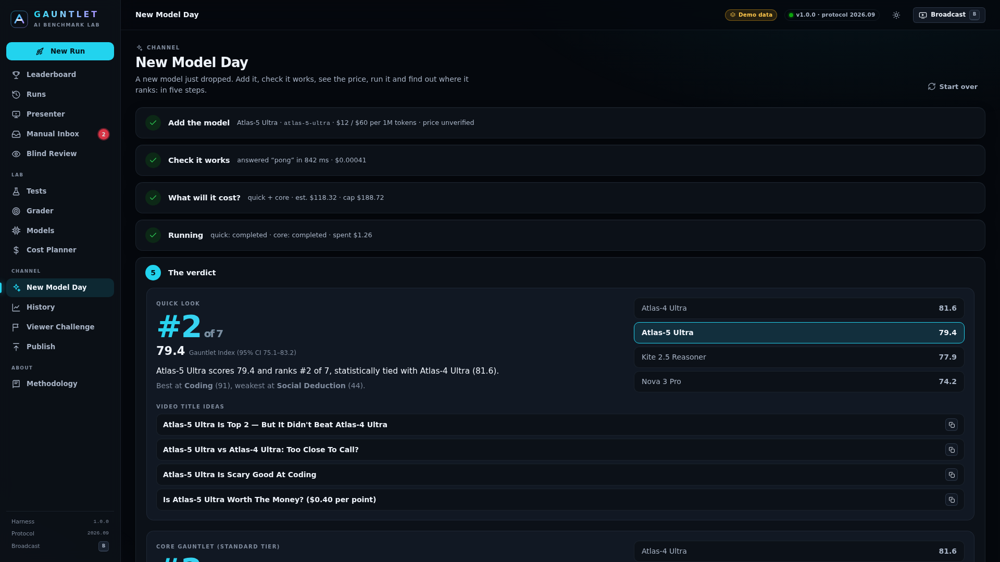
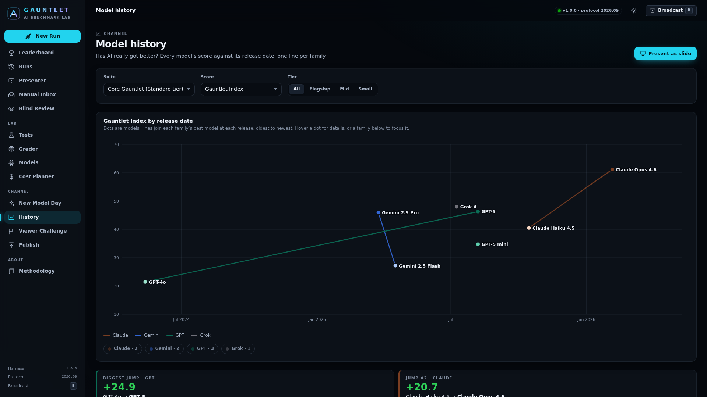
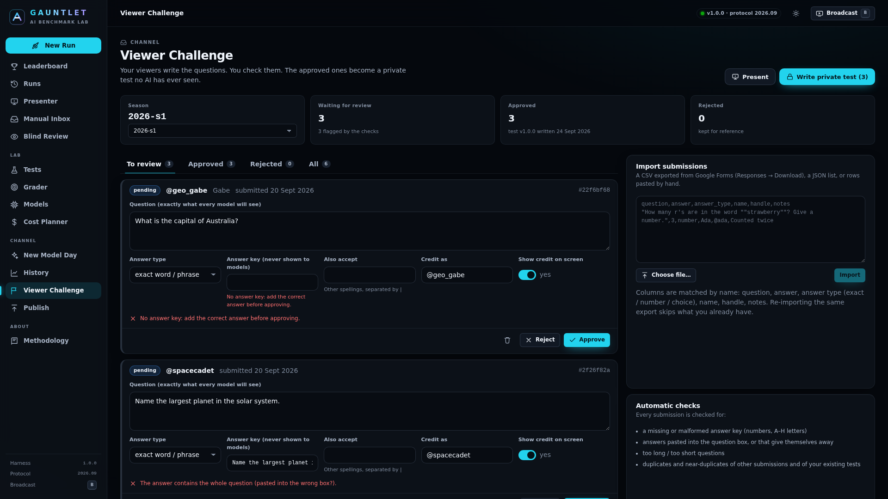

# Channel tools

Four tools for running the channel, all in the dashboard's **Channel** section and on the command line:

| Tool | What it's for |
|---|---|
| [New Model Day](#new-model-day) | A model just launched: add it, check it works, see the price, run it, and get the headline, rank and video titles. |
| [History](#model-history) | "Is AI getting better?": every model's score against its release date, one line per family. |
| [Viewer Challenge](#viewer-challenge) | Turn questions from viewers into a private test, with credit on screen. |
| [Publish](PUBLISHING.md) | Export a free public leaderboard website. |

---

## New Model Day



**Dashboard → New Model Day** walks through five steps:

1. **Add the model**: provider, model id (the box suggests the ids your API key can see), display name,
   prices per million tokens, release date. Tick *I checked these prices…* only if you did; otherwise the
   price is marked **unverified** everywhere. Family (e.g. "GPT") and tier are guessed from the name. This is
   free: it only saves the model to `config/models.json` and checks the id against the provider's list.
2. **Check it works**: a one-word test message. The button shows the price (under a cent).
3. **What will it cost?**: the estimate for Quick Look, Core and Frontier *for this model*. Pick the suites
   and a spending cap (the default is the upper estimate + 10%).
4. **Running**: nothing starts until you confirm a dialog showing the estimate and the cap. Watch it live
   from the *Watch live* button, or leave the page: runs continue on the server.
5. **The verdict**: rank on the combined leaderboard (against every model you've ever run on the same
   tests), who is just above and below, best and worst category, and title ideas with copy buttons.

**Terminal (PowerShell):**

```powershell
node src/cli.ts newmodel                                   # asks every question
node src/cli.ts newmodel --provider openai --model gpt-6 --label "GPT-6" --input-price 5 --output-price 20 --suites quick,core
```

The wizard always prints the cost of `quick`, `core` and `frontier` and asks *"Spend up to $X on this?"* before
running anything, and asks before the test message. Add `--yes` to skip the questions (for scripts), and
`--max-cost 10` to set the cap. Without a terminal and without `--yes`, it stops before the first paid call.
Other options: `--id`, `--vendor`, `--family`, `--tier flagship|mid|small`, `--release-date 2026-10-01`,
`--cached-price`, `--prices-verified`, `--repeats`, `--no-ping`.

## Model history



Each model can carry three optional details (Dashboard → **History** → *Families, release dates and tiers*,
or in `config/models.json`):

```jsonc
{ "id": "gpt-5", "family": "GPT", "releaseDate": "2025-08-07", "tier": "flagship" }   // tier: flagship | mid | small
```

They never change scores or invalidate results. The History page plots the Gauntlet Index (or any category)
against release date, per suite, with a tier filter. Each line joins a family's flagship models (or, for
families without two flagships, its best model per release); smaller siblings stay as dots so a cheap "mini"
never looks like a regression. The **biggest jumps** between consecutive releases are called out. Models with
results but no release date are listed under the chart so you can add the date.

**Present as slide** opens a 1920×1080 "Family history" slide for recording (Esc goes back). The public
website has the same chart on `history.html`.

Release dates are filled in for older models where they are well known; newer ones are left blank for you to add.

## Viewer challenge



### 1. Make the Google Form (once per season)

Create a form at <https://forms.google.com> with these questions (the column names matter less than you'd
think; Gauntlet matches them by keywords):

| Form question (title) | Type | Required | Notes |
|---|---|---|---|
| **Your question** | Paragraph | yes | "Write a question with ONE clear answer. Say what form the answer takes (a number, one word, a letter)." |
| **The correct answer** | Short answer | yes | "Only we see this." |
| **Answer type** | Multiple choice: *Number*, *Exact word or phrase*, *Multiple choice (letter)* | yes | For multiple choice, put the options as `A) … B) …` in the question. |
| **Your name** | Short answer | no | |
| **YouTube handle** | Short answer | no | Shown on screen as the credit, e.g. @yourname |
| **Notes (how do you know the answer?)** | Paragraph | no | Helps you check the answer. |
| **Credit me on screen?** | Multiple choice: *Yes*, *No, keep me anonymous* | no | |

Add a line in the form description: *"Don't post your question publicly: if it's online, future models may
have seen it."* Put the form's share link in `config/site.json` → `submissionFormUrl` (or Publish →
*Viewer challenge form*) and the public website gets a **Submit a question** page.

### 2. Import

In the form: **Responses → ⋮ → Download responses (.csv)**. Then Dashboard → **Viewer Challenge** →
*Choose file…* → **Import**. You can also paste a JSON list or CSV rows. Or in PowerShell:

```powershell
node src/cli.ts challenge import "C:\Users\you\Downloads\Stump the AIs.csv" --season 2026-s1
node src/cli.ts challenge list
```

Re-importing the same export skips submissions you already have. The queue lives in
`data/challenge/<season>.json` (never committed).

### 3. Review

Each submission is checked automatically: missing or malformed answer key (numbers, letters A–H), the answer
pasted into the question box, answers that appear word-for-word in the question, too long or too short,
and duplicates or near-duplicates of other submissions and of **your existing tests**. Errors must be fixed
before you can approve. Edit the question and answer, add accepted alternative spellings, change the credit,
then **Approve** or **Reject**.

### 4. Write the private test

**Write private test** saves the approved questions to `tests/private/viewer-challenge-<season>.json`, a
normal prompt test (number / exact / multiple-choice scoring) with the viewer's credit in each case's notes.
It is held out: git-ignored, never in the prompt book and never on the website. Writing again after edits bumps
the version; existing questions keep their case ids. Run it like any test (New Run → pick it, or
`node src/cli.ts run --models a,b --tests reasoning.viewer-challenge-2026-s1`).

### 5. Present

**Present** opens one 1920×1080 slide per approved question: *"Viewer challenge: submitted by @name"* (or
"a viewer" if they chose anonymity) with the question in big type. Press **→** to reveal the answer and which
models got it right (from the latest run of that test), **→** again for the next question, **Esc** to leave.
Showing a question on video makes it public, so retire it from the next season's test.
