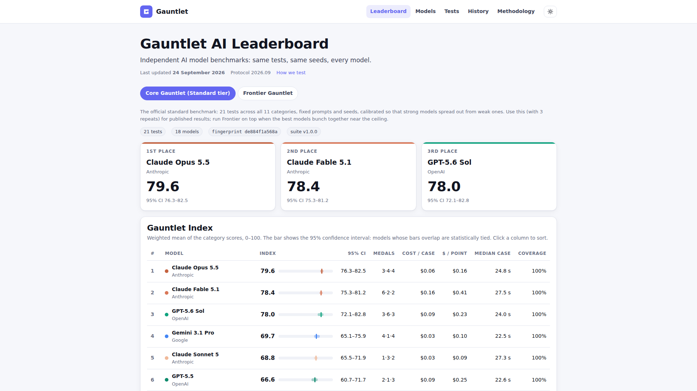

# Publishing your leaderboard website (free, no coding)

Gauntlet can turn your results into a small website: the leaderboards (Index with confidence intervals,
category heatmap, medal table, score vs cost), a page for every model and every test, model history, the
methodology with fingerprints and verified prices, and "last updated". It is plain files (HTML, CSS, a
little JavaScript and JSON), so it needs no server and can be hosted for free.



## 1. Set your branding (once)

Dashboard → **Publish** → *Channel branding*, then **Save**. Or edit `config/site.json` in Notepad:

| Field | What it does | Example |
|---|---|---|
| `channelName` | Name in the header and page titles | `"Model Arena"` |
| `tagline` | One line under the name | `"Independent AI benchmarks"` |
| `logo` | A `.png`/`.jpg`/`.svg` in the gauntlet folder, or an `https://` link. Empty = Gauntlet mark | `"config/logo.png"` |
| `youtubeUrl` | Adds a YouTube button to every page | `"https://www.youtube.com/@you"` |
| `accentColor` | Links, buttons, highlights | `"#6366F1"` |
| `suites` | Leaderboards to publish, in tab order | `["core", "frontier"]` |
| `siteUrl` | Your site's address once online (footer) | `"https://you.github.io/leaderboard"` |
| `submissionFormUrl` | Adds a **Submit a question** page linking to your Google Form (see [CHANNEL.md](CHANNEL.md#viewer-challenge)) | `"https://forms.gle/…"` |
| `season` | Current viewer-challenge season | `"2026-s1"` |
| `footerNote` | Small print | `"Independent and unsponsored."` |

## 2. Export

* **Dashboard:** Publish → pick the suites → **Publish website**. Then **Preview the site** to check it, or
  **Download as .zip**.
* **Terminal (PowerShell):**

  ```powershell
  node src/cli.ts publish                                  # core + frontier into gauntlet\site
  node src/cli.ts publish --suite core,frontier --out C:\Users\you\Desktop\leaderboard --zip
  ```

Open `index.html` in the folder by double-clicking it: the site works straight from your disk. Re-export
whenever you have new results; Gauntlet replaces only the files it wrote before and refuses to write into a
folder that has other things in it.

### What is never published

* **Held-out tests** (`tests/private/`, including your Viewer Challenge): they count in the Index but are
  listed only as "Held-out test 1, 2…" with no name, description, prompt or answer.
* **Answer keys, case notes and per-case summaries** of every test (summaries can quote the expected answer).
* **Model notes, provider settings and API keys.**
* **Example prompts** of any test or suite that has `"publishPrompts": false`. Set this on a test you want
  to keep reusing without models memorising it. It does not change the test's hash, so your results stay valid.

## 3. Put it online

### Option A: Netlify Drop (easiest, about 2 minutes)

1. Export the site (step 2).
2. Open <https://app.netlify.com/drop> in your browser and sign up (free; "Sign up with GitHub" or email).
3. Open File Explorer and find the `site` folder (by default `gauntlet\site`).
4. **Drag the whole `site` folder** onto the Netlify page. Wait for the upload to finish.
5. Netlify shows your address, like `https://sparkly-otter-123.netlify.app`. Under *Site configuration →
   Change site name* you can pick a nicer one.
6. **To update:** export again, open your site in Netlify → *Deploys* → drag the `site` folder onto
   "Need to update your site? Drag and drop your site output folder here".

### Option B: GitHub Pages (free, good if you already use GitHub)

1. Sign in at <https://github.com> and click **New repository**. Name it e.g. `leaderboard`, choose
   **Public**, tick **Add a README file**, click **Create repository**.
2. In the repository click **Add file → Upload files**.
3. Open the `site` folder in File Explorer, select everything inside it (**Ctrl+A**) and drag it onto the
   GitHub page. (Include the `.nojekyll` file; if you can't see it, enable *View → Show → Hidden items*.)
   Click **Commit changes**.
4. Go to **Settings → Pages**. Under *Build and deployment* choose **Deploy from a branch**, branch **main**,
   folder **/ (root)**, then **Save**.
5. After a minute your site is at `https://<your-user-name>.github.io/leaderboard/`. Put that address in
   `siteUrl` and re-export if you want it in the footer.
6. **To update:** export again and upload the files the same way (GitHub replaces files with the same name).
   If you removed a model, delete its old page in GitHub too, or delete and re-upload everything.

### Any other host

Upload the contents of the folder to any static host (Cloudflare Pages, a web server, an S3 bucket). There
are no server-side requirements.

## What's in the folder

```
index.html            leaderboards (one tab per suite)
models.html           every model, with family, release date and price
models/<id>.html      one page per model
tests.html            every test, grouped by category
tests/<id>.html       one page per test: what it measures, how it is scored, an example prompt
history.html          Gauntlet Index against release date, one line per family
methodology.html      rules, scoring, fingerprints, prices with verified dates, canary
challenge.html        "Submit a question" (only when submissionFormUrl is set)
assets/               site.css, site.js, your logo
data/site.json        all published numbers (for anyone who wants to audit or reuse them)
gauntlet-site.json    list of the files Gauntlet wrote (used for clean re-exports)
```
